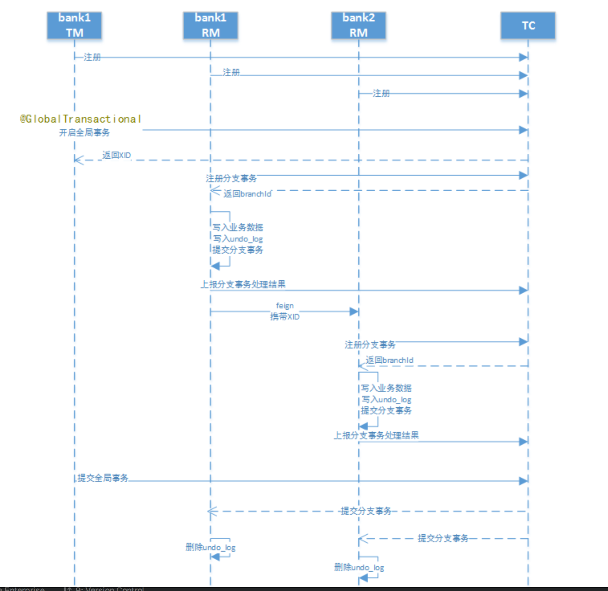
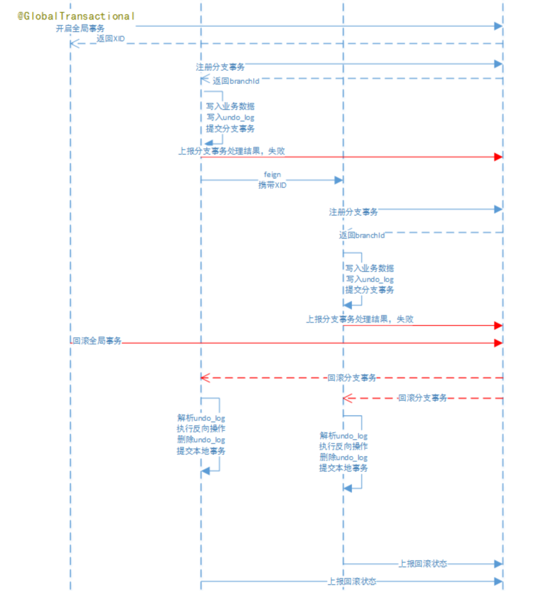

## Seata 分布式事务 AT模式 demo

#### 场景: 跨行转账
两个账户在不同的银行(张三在bank1、李四在bank2)，bank1和bank2是两个个微服务。  
交易过程是，张三 给李四转账指定金额。    

交互流程如下: 
1. 请求bank1进行转账，传入转账金额。 
2. bank1减少转账金额，调用bank2，传入转账金额, bank2添加转账金额。

#### 工具
- 数据库: MySQL 5.7。bank 1 和bank 2
- JDK 1.8 +
- 微服务框架: spring-boot, spring-cloud
- 分布式事务: seata
    - RM, TM: spring-cloud-alibaba-seata 
    - TC: seata-server, 单独部署

#### 步骤
##### 1. 创建数据库
`bank1`库 & `bank2`库 
- `account_info`表，`bank1`包含'张三'账户，`bank2`包含'李四'账户
- `undo_log`表，为seata框架使用
参考本工程`sql`目录

##### 2. 启动TC(Transaction Coordinator)
下载：https://github.com/seata/seata/releases/  
启动：`${SEATA_PATH}/bin/seata-server.sh -p 8888 -m file`。8888为服务端口号;file为启动模式，这里指seata服务将采用文件的方式存储信息。出现`Server started...`的字样则表示启动成功。

##### 3. 启动服务注册中心
基于Eureka实现注册中心。

##### 4. 业务工程配置seata
在`src/main/resource`中，新增两个文件。
- `registry.conf`
- `file.conf`  

内容可以copy上面TC server下面的`config`目录的文件，然后：  
- 在`registry.conf`中`registry.type`使用`file`
- 在`file.conf`中，
    - `service.vgroup_mapping.[springcloud服务名]-fescar-service-group = [Seata Server集群名称]`，Seata Server集群默认名称为default  
    - `service.default.grouplist =[seata服务端地址]`

##### 5. 创建代理数据源
Seata的RM通过`DataSourceProxy`才能在业务代码的事务提交时，通过这个切入点，与TC进行通信交互、记录undo_log等。  
添加`DatabaseConfiguration.java`。

```java
@Configuration
public class DatabaseConfiguration {
    private final ApplicationContext applicationContext;

    public DatabaseConfiguration(ApplicationContext applicationContext) {
        this.applicationContext = applicationContext;
    }

    @Bean
    @ConfigurationProperties(prefix = "spring.datasource.ds0")
    public DruidDataSource ds0() {
        DruidDataSource druidDataSource = new DruidDataSource();
        return druidDataSource;
    }


    @Primary
    @Bean
    public DataSource dataSource(DruidDataSource ds0)  {
        DataSourceProxy pds0 = new DataSourceProxy(ds0);
        return pds0;
    }
}
```

#### 执行流程
1. 全局事务开始使用 @GlobalTransactional标识 。 
2. 每个本地事务方案仍然使用@Transactional标识。 
3. 每个数据都需要创建undo_log表，此表是seata保证本地事务一致性的关键。

`@GlobalTransactional`注解标注在全局事务发起的Service实现方法上，开启全局事务: 
- `GlobalTransactionalInterceptor`会拦截`@GlobalTransactional`注解的方法，生成全局事务ID(XID)，XID会在整个
分布式事务中传递。 
- 在远程调用时，`spring-cloud-alibaba-seata`会拦截`Feign`调用将XID传递到下游服务。

1. 提交流程
  
2. 回滚流程
  

tips:
1. 每个RM使用`DataSourceProxy`连接数据库，其目的是使用`ConnectionProxy`，使用数据源和数据连接代理的目的就是在第一阶段将`undo_log`和业务数据放在一个本地事务提交，这样就保存了只要有业务操作就一定有`undo_log`。
2. 在第一阶段`undo_log`中存放了数据修改前和修改后的值，为事务回滚作好准备，所以第一阶段完成就已经将分支事务提交，也就释放了锁资源。
3. TM开启全局事务开始，将`XID`全局事务id放在事务上下文中，通过feign调用也将`XID`传入下游分支事务，每个 分支事务将自己的`Branch ID`分支事务ID与`XID`关联。
4. 第二阶段全局事务提交，TC会通知各各分支参与者提交分支事务，在第一阶段就已经提交了分支事务，这里各 各参与者只需要删除`undo_log`即可，并且可以异步执行，第二阶段很快可以完成。
5. 第二阶段全局事务回滚，TC会通知各各分支参与者回滚分支事务，通过 XID 和 Branch ID 找到相应的回滚日 志，通过回滚日志生成反向的 SQL 并执行，以完成分支事务回滚到之前的状态，如果回滚失败则会重试回滚操 作。


#### 测试场景
- 张三向李四转账成功。
- 李四事务失败，张三事务回滚成功。
- 张三事务失败，李四事务回滚成功。
- 分支事务超时测试。
